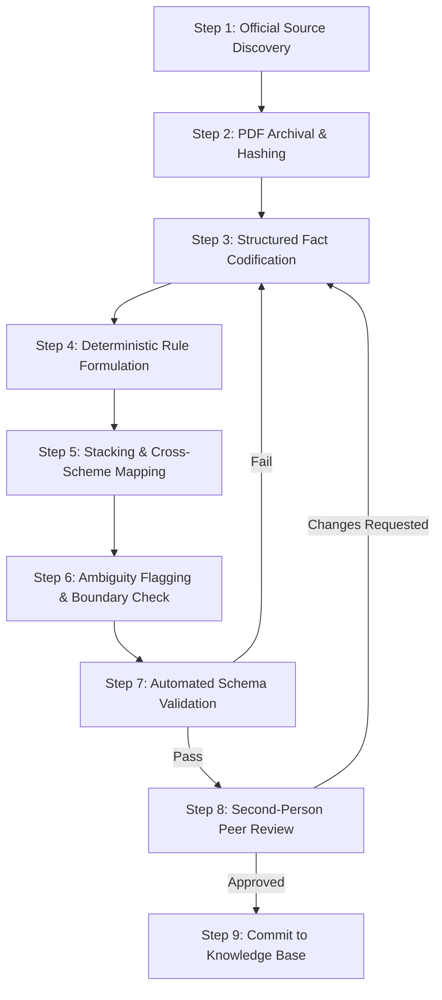

# Standard Operating Procedure (SOP): Official MSME Scheme Data Curation

**Document ID**: SOP-UDYAMNITI-CUR-001  
**Version**: 1.0  
**Effective Date**: 2026-09-30  
**Author**: Government Policy Research Lead & Data Curation Team  
**Scope**: Manual curation, structured codification, and two-person verification of 30–50 Central and Gujarat State MSME schemes.

---

## 1. Purpose & Core Principles
The goal of UdyamNiti data curation is to convert unstructured official gazettes, operational guidelines, and government resolutions into **100% deterministic, evidence-grounded machine-evaluable rules**.

### Core Tenets:
1. **Primary Official Sources Only**: Every policy rule must originate directly from a `.gov.in` or `.nic.in` domain (e.g., `msme.gov.in`, `egazette.gov.in`, `industries.gujarat.gov.in`, `ifp.gujarat.gov.in`). Third-party blogs, consultant summaries, and news articles are strictly prohibited.
2. **Zero Unsupported Inference**: If a statutory guideline does not state a condition, the curator must not assume or extrapolate it. Missing parameters must be classified as `UNKNOWN` or logged under `ambiguity_notes`.
3. **Exact Passage and Page Pinpointing**: Every condition, benefit calculation, and prerequisite must cite the exact clause or section number, physical PDF page number, and verbatim statutory excerpt.
4. **Bitemporal Versioning**: Policies evolve. When guidelines are revised (e.g. Gujarat Industrial Policy 2020 superseded by 2025 revision), older versions are never deleted. Instead, the `effective_until` date is set and a new version is created.
5. **Mandatory Two-Person Review Gate**: A rule cannot be marked `published` or imported into the evaluation engine without independent review and sign-off by a secondary policy legal analyst.

---

## 2. Roles & Responsibilities

| Role | Responsibilities | Required Competencies |
|---|---|---|
| **Policy Research Curator (Author)** | Discovers primary source documents, downloads and hashes PDFs, extracts structured fields, maps deterministic rule logic, fills out the JSON/Spreadsheet template. | Government policy analysis, legal document interpretation, JSON literacy. |
| **Legal / Policy Reviewer (Second Eye)** | Independently verifies quotes against original PDF, checks boundary conditions, validates non-duplication / GFR clauses, ensures no hallucinated criteria. | Administrative law, MSME scheme compliance, statutory auditing. |
| **Knowledge Base Lead (Approver)** | Runs automated schema and security validator, merges validated program files into active fixtures, tags policy version. | Data engineering, Django test suite execution, Git workflow. |

---

## 3. Step-by-Step Curation Workflow



### Step 1: Official Source Discovery & Tiering
Curators must identify and record the highest legal authority tier available for the scheme:
- **Tier 1 (Gazette Notification)**: Official Gazette of India or Gujarat Government Gazette published by the Government Press. Highest statutory standing.
- **Tier 2 (Operational Guidelines / Government Resolution)**: Approved administrative guidelines issued by the Ministry of MSME, DC-MSME, or Gujarat Industries and Mines Department (GRs).
- **Tier 3 (Ministry Circular / Office Memorandum)**: Clarification circulars, amendment orders, or procedural notifications issued by Joint Secretaries or Nodal agencies (SIDBI, KVIC, NSIC).
- **Tier 4 (Implementation Portal FAQ / Manual)**: Official step-by-step applicant user manuals hosted on verified government portals (`udyamregistration.gov.in`, `ifp.gujarat.gov.in`, `clcss.dcmsme.gov.in`).

### Step 2: Document Archival & PDF Page Pinpointing
1. Download the original PDF from the verified `.gov.in` portal.
2. Record the direct URL, issuing authority, and official notification/circular reference number.
3. Compute and record the SHA-256 hash of the PDF to safeguard against silent portal revisions.
4. Record physical PDF page numbers (as printed on the document and in the PDF reader view).

### Step 3: Structured Fact Extraction
For every program, the curator extracts:
- `official_scheme_name`: Full legal title as written in the Gazette / GR.
- `short_name`: Recognizable industry acronym (e.g. `CLCSS`, `ZED Scheme`, `Gujarat Capital Subsidy`).
- `authority`: Full name of administering Ministry / Directorate (e.g., `Ministry of MSME, Government of India`, `Industries & Mines Department, Government of Gujarat`).
- `central_or_state`: `'central'` or `'state'`.
- `applicable_state`: State name (e.g. `'Gujarat'`) if state-level.
- `objective`: Stated policy goal in the preamble.
- `support_categories`: List of standardized tags (`capital_subsidy`, `interest_subvention`, `collateral_free_credit`, `quality_certification`, `technology_adoption`, `infrastructure_grant`, `export_incentive`).
- `benefit_type`: Financial mechanism (e.g., upfront reimbursement, back-ended subsidy, credit guarantee, interest subvention).
- `target_enterprises`: Standardized MSME categories (`micro`, `small`, `medium`).
- `target_sectors`: Eligible industrial categories (`Manufacturing`, `Engineering`, `Textiles`, `Plastic & Polymers`, `Food Processing`, `All`).
- `exclusions`: Statutory negative list (e.g. gambling, tobacco, alcohol, sawmills, secondary power generation).

### Step 4: Deterministic Rule Formulation
Translate statutory requirements into unambiguous deterministic rules:
- **Normalized Field Paths**: Map conditions strictly to standard `BusinessProfile` attributes:
  - `business_profile.msme_category`
  - `business_profile.state`
  - `business_profile.district`
  - `business_profile.annual_turnover_lakhs`
  - `business_profile.investment_in_plant_machinery_lakhs`
  - `business_profile.is_npa`
  - `business_profile.years_in_operation`
  - `business_profile.has_bank_account`
  - `business_profile.is_women_owned`
  - `business_profile.is_sc_st_owned`
  - `goal.parsed_project_type`
  - `goal.parsed_investment_amount_lakhs`
- **Supported Operators**: `eq`, `ne`, `gt`, `gte`, `lt`, `lte`, `in`, `not_in`, `bool_true`, `bool_false`, `contains`, `between`.
- **Rule Importance**:
  - `mandatory`: Non-compliance immediately disqualifies the enterprise (`status = DOES_NOT_MATCH`).
  - `preferred`: Non-compliance lowers ranking score but does not disqualify.
  - `bonus`: Triggers an additional incentive percentage (e.g. +5% subsidy for women or SC/ST promoters).
  - `info`: Informational flag requiring user review.

### Step 5: Cross-Scheme Stacking & Non-Duplication Mapping
Carefully inspect whether the program can be claimed in conjunction with other state or central benefits:
- Check for **GFR 230(1)** clauses ("Grantee institution shall certify that it has not received assistance for the same purpose from any other source").
- Check for state top-up authorizations (e.g. Gujarat MSME Policy allows state capital subsidy on top of central CLCSS, provided total assistance does not exceed 100% of machine cost).
- Categorize relationship: `stacks_with`, `prerequisite_for`, `mutually_exclusive`, `sequential`, `alternative_to`.
- Cite the exact clause authorizing or barring combination.

### Step 6: Ambiguity Flagging & Boundary Analysis
If a statutory provision contains discretionary wording such as "subject to officer inspection", "viable project as per bank satisfaction", or undefined local zoning rules:
1. Mark the rule with `ambiguity_notes`.
2. Do not write a strict binary pass/fail for ambiguous criteria. Set `importance: info` or classify as `UNKNOWN` requiring physical verification.
3. Log the ambiguity in the curation sheet for legal review.

### Step 7: Automated Schema Validation
Run the automated curation validator:
```bash
python -m apps.policies.curation.validator apps/policies/curation/curated_programs/my_program.json
```
The validator enforces:
- Valid JSON schema against `CanonicalScheme` Pydantic models.
- Domain allowlist verification (URL must end in `.gov.in` or `.nic.in`).
- Mandatory evidence fields (`exact_quote`, `clause_or_section`, `page_number`).
- Date integrity (`effective_date <= last_verified_date`).

### Step 8: Second-Person Peer Review
A secondary researcher verifies the file against the [QA Checklist](qa_checklist.md). Both curator and reviewer record their signatures, timestamp, and review notes in the metadata.

---

## 4. Retaining Old Policy Versions
When a government department revises an active scheme:
1. **Never mutate an active published record in place**.
2. Clone the existing JSON file.
3. On the old record: Set `effective_until` to the date before the new policy takes effect, and set `status: "superseded"`.
4. On the new record: Increment `version: version + 1`, update rules/benefits, set `effective_date`, and reference `supersedes_scheme_id`.
5. Both versions remain queryable in UdyamNiti to handle retroactive claims for investments made during the previous policy window.
